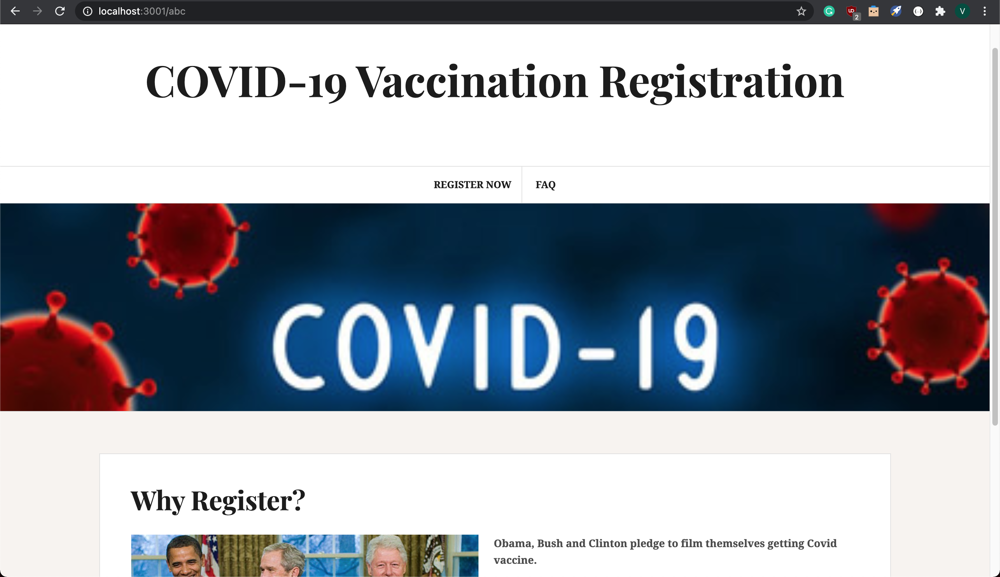
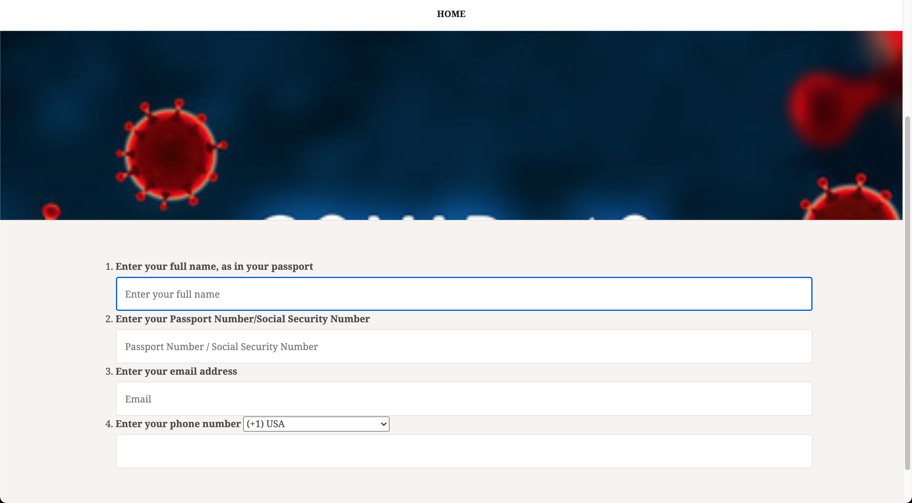
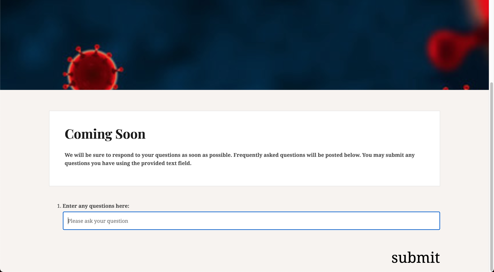

# README

## Description

This is a web application that is meant to help people register for the COVID-19 vaccination.

### Home Page:



### Registration Page:



### FAQ Page:



### How to use the web app:

[](https://www.youtube.com/watch?v=HUL_7TkWnUA&feature=youtu.be)

## Setup & Run

See [gemfile](Gemfile) for all the requirements needed to run this web application.

```
git clone git@github.com:Vicolee/covid-vaccination-web.git
cd covid-vaccination-web
bundle install
rails server
```

